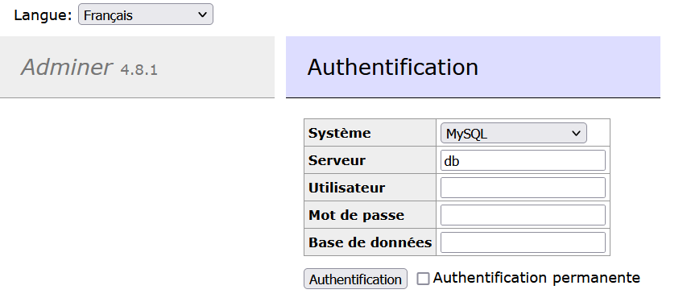
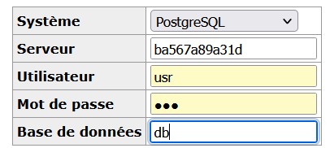
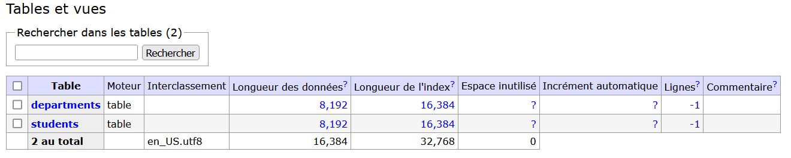
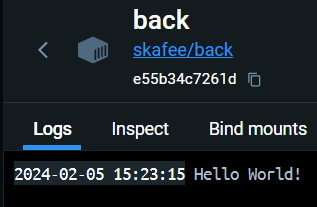
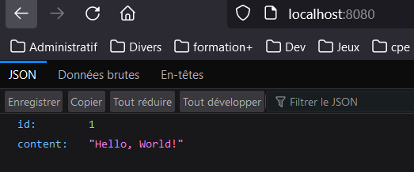
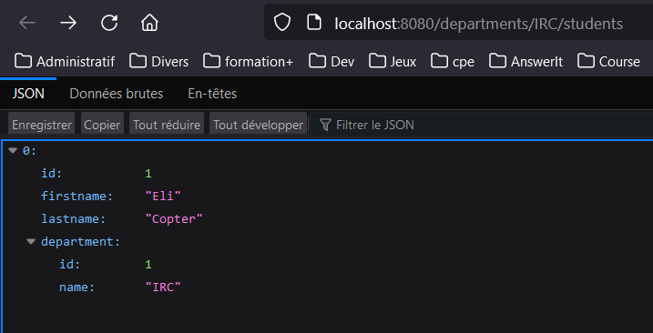
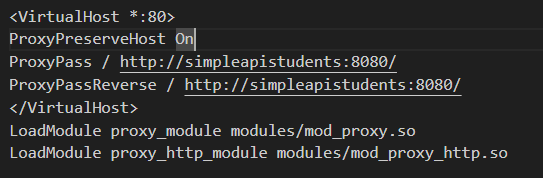
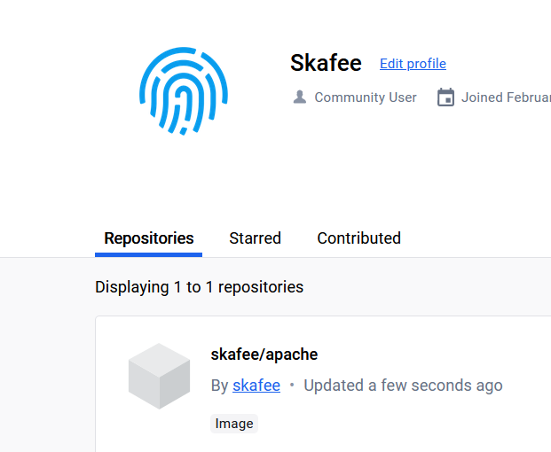

# TP1 DevOps - Docker

Author: Antoine PERRONO - 4IRC

## Database
### Installation
Création du dockerfile:
```
FROM postgres:14.1-alpine

ENV POSTGRES_DB=db \
   POSTGRES_USER=usr \
   POSTGRES_PASSWORD=pwd
```
Build : `docker build -t skafee/postgres .`

### adminer
```shell
$ docker ps
CONTAINER ID   IMAGE             COMMAND                  CREATED         STATUS         PORTS      NAMES
19a874f311c2   skafee/postgres   "docker-entrypoint.s…"   9 minutes ago   Up 9 minutes   5432/tcp   adoring_faraday
$ docker run -d --link adoring_faraday:db -p 8080:8080 adminer
```
Installation d'adminer réussi :



On crée un network: `docker network create app-network`

On ajoute au dockerfile : `COPY db /docker-entrypoint-initdb.d`

On stop tout les container avec `docker stop <img_id>`

On relance notre postgres: `docker run -d --net=app-network --name db skafee/postgres` et adminer `docker run -p "8090:8080" --net=app-network --name=adminer -d adminer`

On peut maitenant se connecter et voir notre BD.




Pour la **persistance** des données, on utilise : 
`docker run -d -v /tmp/db_deskstop/:/var/lib/postgresql/data --net=app-network --name db skafee/postgres`

## Backend API

On crée notre Dockerfile:
```Dockerfile
FROM eclipse-temurin:11

RUN mkdir /opt/app
COPY Main.class /opt/app
WORKDIR /opt/app

CMD ["java", "Main"]
```

Au run, on obtient bien un log **Hello world!**



### Multistage build
#### Backend simple API
Aprés import de l'app Springboot, et avec ce Dockerfile:
```java
package fr.takima.training.simpleapi.controller;

import org.springframework.web.bind.annotation.*;

import java.util.concurrent.atomic.AtomicLong;

@RestController
public class GreetingController {

   private static final String template = "Hello, %s!";
   private final AtomicLong counter = new AtomicLong();

   @GetMapping("/")
   public Greeting greeting(@RequestParam(value = "name", defaultValue = "World") String name) {
       return new Greeting(counter.incrementAndGet(), String.format(template, name));
   }

   record Greeting(long id, String content) {}

}

```
On peut build l'image: `docker build -t skafee/simpleapi .` et run `docker run -d --name simpleapi -p "8080:8080" skafee/simpleapi`

TADA on a bien une "api" d'accessible: 



**Question 1.2**:
On a ici besoin d'un de multi-stage parce que :
- Simplification: on simplifie le process de build en utilisant des bases images adaptées à chaque utilisation (build & run).
- Sécurité: l'environnement de run était différent de celuui de builds, on ne garde pas builds tools inutile voir dangereux.
- Optimisation du dockerfile et de l'image finale, encore une fois on ne garde pas d'outil inutile dans l'environnement de run par exemple.

Explication du dockerfile:

FROM maven:3.8.6-amazoncorretto-17 AS myapp-build **utilisation de maven en base image pour le build**  
ENV MYAPP_HOME /opt/myapp **Création d'une variable d'environement**  
WORKDIR $MYAPP_HOME **Changement du working directory**  
COPY pom.xml . **Copie des fichiers nécessaires.**  
COPY src ./src **Idem**  
RUN mvn package -DskipTests **On compile l'app en un fichier jar**  

FROM amazoncorretto:17 **Import d'une base image**  
ENV MYAPP_HOME /opt/myapp **Création d'une variable d'environment**  
WORKDIR $MYAPP_HOME **Changement du working directory**  
COPY --from=myapp-build $MYAPP_HOME/target/*.jar $MYAPP_HOME/myapp.jar **Copie de fichier jar**  

ENTRYPOINT java -jar myapp.jar  **Set la commande par défaut pour run l'app lors du lancement du container**  


#### Backend API
Voici le nouveau fichier `application.yml`:
```yaml
spring:
  jpa:
    properties:
      hibernate:
        jdbc:
          lob:
            non_contextual_creation: true
    generate-ddl: false
    open-in-view: true
  datasource:
    url: http://localhost:8090/
    username: usr
    password: pwd
    driver-class-name: org.postgresql.Driver
management:
 server:
   add-application-context-header: false
 endpoints:
   web:
     exposure:
       include: health,info,env,metrics,beans,configprops
```

On utilise un ReadMe identique et `docker build -t skafee/simple-api-students .` `docker run -dit --name simpleapistudents --net=app-network -p "8080:8080" skafee/simpleapi-students` et on voit bien une api permettent d'accès à notre container postgre:


## Http server
### Basic

On va utiliser une image [Apache](https://hub.docker.com/_/httpd) pour faire notre serveur HTTP.

On utilise en **Dockerfile**:
```
FROM httpd:2.4

COPY ./public/ /usr/local/apache2/htdocs/
```
Et on lance avec : 
```shell
docker build -t skafee/apache .
docker run -dit --name webserver -p 8080:80 skafee/apache
```

### Useful command

- **docker stats** nous permet de voir ce chaque container en cours consome sur notre machine,
- **docker inspect** nous permet nous retourne un json reprenant l'ensemble de configuration du container spécifié,
- **docker logs** permet de retourner les logs d'un container spécifié.

### Configuration
```shell
docker exec webserver sh -c "cat /usr/local/apache2/conf/httpd.conf"
```

Cela nous permet de voir le ficher de configuration utilisé par apache [httpd.conf](./src/http/httpd.conf)

### Reverse proxy

**Nouvelle configuration httpd**:


On modifie notre ficher de configuration et l'import dans l'image avec `docker cp src/http/httpd.conf webserver:/usr/local/apache2/conf/httpd.conf` puis on restart le container et TADAMM notre reverse proxy fonctionne. On peut aussi l'automatiser en modifiant le docker file du httpserver:
```Dockerfile
FROM httpd:2.4

COPY ./public/ /usr/local/apache2/htdocs/
COPY ./httpd.conf /usr/local/apache2/conf/httpd-custom.conf

RUN echo "Include ./conf/httpd-custom.conf" >> /usr/local/apache2/conf/httpd.conf
```

Le reverse proxy est utile pour centraliser les requetes et faire du load balancer.

**Question 1.3**:
Some very useful docker compose command:
- up (-d)
- down
- start
- stop
- build

**Question 1.4**:
See comments in [docker-compose.yaml](./docker-compose.yml)

## Link application
Wouhaaaa ça marche 



**Question 1.5**:
Pour push sur docker hub, on commence par créer un token sur le site, on l'utilise lors du login puis on push.
```shell
docker login -u skafee
docker push skafee/apache
```