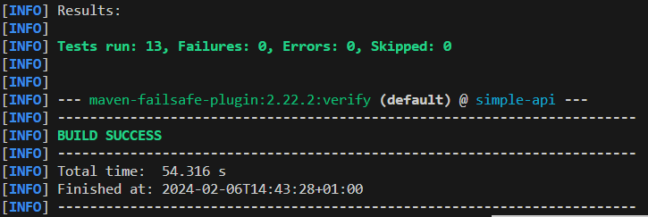

# TP2 DevOps - Github action

Author: Antoine PERRONO - 4IRC

## First step

Avec `mvn clean verify`, on voit bien que l'ensemble des tests run.

Les tests unitaires et d'intégration n'ont pas la même portée. Les tests unitaires testent des parties isolées du code, comme chaque fonction séparemment, afin de valider le fonctionnement du comportement à une petite échelle. Les tests d'intégration testent dans un ensemble plus globale, que tout les éléments fonctionnenent bien ensemble.

**Question 2.1:**
They simply are java libraries that allow you to run a bunch of docker containers while testing. 

**Question 2.2:**
See [main.yaml](../.github/workflows/main.yaml)

## bonus:

See :
- [test-backend.yml](../.github/workflows/test-backend.yaml)
- [build-and-push-docker-image.yml](../.github/workflows/build-and-push-docker-image.yaml)